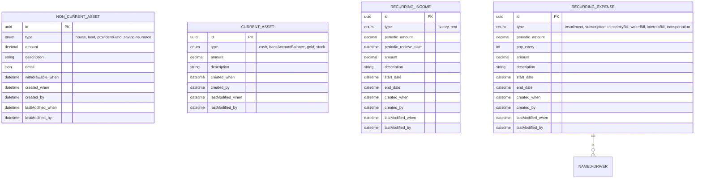

```mermaid
erDiagram
    NON_CURRENT_ASSET {
        uuid id PK
        enum type "house, land, providentFund, savingInsurance"
        decimal amount
        string description
        json detail
        datetime withdrawable_when
        datetime created_when
        datetime created_by
        datetime lastModified_when
        datetime lastModified_by
    }
    CURRENT_ASSET {
        uuid id PK
        enum type "cash, bankAccountBalance, gold, stock"
        decimal amount
        string description
        datetime created_when
        datetime created_by
        datetime lastModified_when
        datetime lastModified_by
    }
    RECURRING_INCOME {
        uuid id PK
        enum type "salary, rent"
        decimal periodic_amount
        datetime periodic_recieve_date
        decimal amount
        string description
        datetime start_date
        datetime end_date
        datetime created_when
        datetime created_by
        datetime lastModified_when
        datetime lastModified_by
    }
    RECURRING_EXPENSE ||--o{ NAMED-DRIVER : is
    RECURRING_EXPENSE {
        uuid id PK
        enum type "installment, subscription, electricityBill, waterBill, internetBill, transportation"
        decimal periodic_amount
        int pay_every
        decimal amount
        string description
        datetime start_date
        datetime end_date
        datetime created_when
        datetime created_by
        datetime lastModified_when
        datetime lastModified_by
    }

```